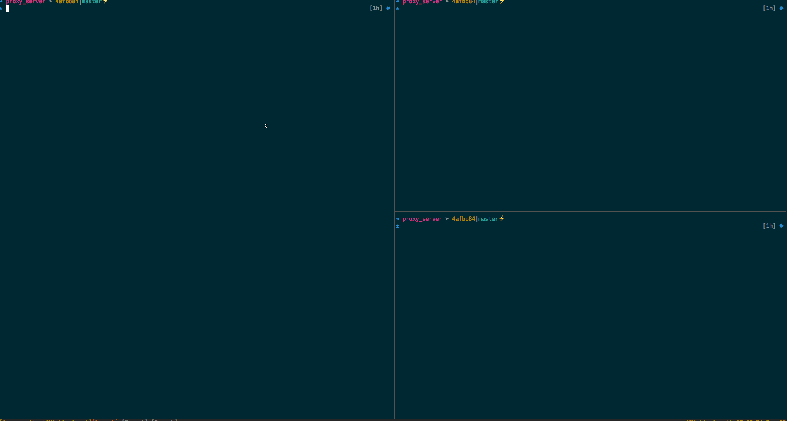
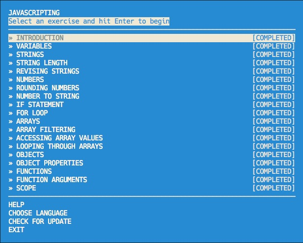
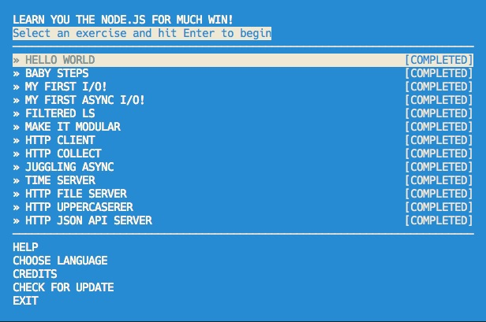

# coderschool-nodejs-proxy-sever
This is Prework for [Coderschool](http://www.coderschool.vn) NodeJs Course  on Tuesday, October 18

Time spent: [1 hour]

Completed:

* [x] Required: Requests to port `8000` are echoed back with the same HTTP headers and body
* [x] Required: Requests/reponses are proxied to/from the destination server
* [x] Required: The destination server is configurable via the `--host`, `--port`  or `--url` arguments
* [x] Required: The destination server is configurable via the `x-destination-url` header
* [x] Required: Client requests and respones are printed to stdout
* [x] Required: The `--logfile` argument outputs all logs to the file specified instead of stdout
* [] Optional: The `--exec` argument proxies stdin/stdout to/from the destination program
* [x] Optional: The `--loglevel` argument sets the logging chattiness
* [] Optional: Supports HTTPS
* [x] Optional: `-h` argument prints CLI API

Walkthrough Gif:


Note: to embed the gif file, just check your gif file into your repo and update the name of the file above.

## Starting the Server

```bash
node index.js
```

## Features

### Echo Server:

```bash
curl http://127.0.0.1:8000/ -d 'Hello Proxy' -H 'foo:bar' -v
*   Trying 127.0.0.1...
* Connected to 127.0.0.1 (127.0.0.1) port 8000 (#0)
> POST / HTTP/1.1
> Host: 127.0.0.1:8000
> User-Agent: curl/7.49.1
> Accept: */*
> foo:bar
> Content-Length: 11
> Content-Type: application/x-www-form-urlencoded
>
* upload completely sent off: 11 out of 11 bytes
< HTTP/1.1 200 OK
< host: 127.0.0.1:8000
< user-agent: curl/7.49.1
< accept: */*
< foo: bar
< content-length: 11
< content-type: application/x-www-form-urlencoded
< Date: Sat, 24 Sep 2016 09:35:12 GMT
< Connection: keep-alive
<
* Connection #0 to host 127.0.0.1 left intact
Hello Proxy
```

### Proxy Server:

Port 9000 will proxy to the echo server on port 8000.

```bash
curl http://127.0.0.1:9000/ -d 'Hello Proxy' -H 'foo:bar' -v
*   Trying 127.0.0.1...
* Connected to 127.0.0.1 (127.0.0.1) port 9000 (#0)
> POST / HTTP/1.1
> Host: 127.0.0.1:9000
> User-Agent: curl/7.49.1
> Accept: */*
> foo:bar
> Content-Length: 11
> Content-Type: application/x-www-form-urlencoded
>
* upload completely sent off: 11 out of 11 bytes
< HTTP/1.1 200 OK
< host: 127.0.0.1:8000
< user-agent: curl/7.49.1
< accept: */*
< foo: bar
< content-length: 11
< content-type: application/x-www-form-urlencoded
< connection: close
< date: Sat, 24 Sep 2016 09:33:52 GMT
<
* Closing connection 0
Hello Proxy
```


### Configuration:

```
node index.js -h
Usage: node index.js [options]

Options:
  -h, --host, --help  Show help                                        [boolean]
  -p, --port          The port of the destination server.
  -u, --url           A single url that overrides the host and port.
  -f, --logfile       Specify a file path to redirect loggin to.
  -l, --loglevel      Specify the level of logger.

Examples:
  node index.js -h=127.0.0.1 -p 8000
```

#### CLI Arguments:

The following CLI arguments are supported:

##### `--host`

The host of the destination server. Defaults to `127.0.0.1`.

##### `--port`

The port of the destination server. Defaults to `80` or `8000` when a port is not specified.

##### `--url`

A single url that overrides the above. E.g., `google.com`

##### `--logfile`

Specify a file path to redirect logging to. Eg `log.txt`

##### `--loglevel`

Sepcify the level of loggger. Eg `debug`

#### Headers

The follow http header(s) are supported:

##### `x-destination-url`

Specify the destination url on a per request basis. Overrides and follows the same format as the `--url` argument.

### Workshoper

Javascripting:



Learnyounode:


